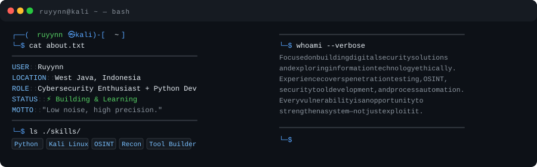

<h1 align="center">
  Hi there, I'm Ruyynn
  
</h1>

  

  &nbsp;
  
  <samp>All tools are <b>free & open source</b> — built with Python: clean and efficient.</samp>
  &nbsp;
  

  Explore the repositories — more tools coming soon. See you there!

**`Red Team · Python Dev · Open Source`**

&nbsp;

---

  

## 👤 About Me

---

## Tech Stack

### Languages & Dev

### Systems & Environment

### Tools & Workflow

### Security & Pentesting

---

## 🛠️ Featured Projects

<table align="center">
  <tr>
    <td width="25%" align="center" valign="top">
      <h3><a href="https://github.com/ruyynn/GhostIntel">👻 GhostIntel</a></h3>
      

        <b>OSINT Framework</b> 
        Phone · Username · IP · Domain intelligence from public sources. Fast, legal, and ethical.
      

      

        
        
      

      

        
        
        
      

      

        
<b>🔍 Features</b>

        <ul align="left">
          <li>📱 Phone OSINT — ID, US, GB, MY, IN</li>
          <li>👤 Username Search — Multi Platform</li>
          <li>📧 Email OSINT</li>
          <li>🌐 My IP Intelligence</li>
        </ul>
      

    </td>
    <td width="25%" align="center" valign="top">
      <h3><a href="https://github.com/ruyynn/VulnDraft">🐞 VulnDraft</a></h3>
      

        <b>Bug Report Generator</b> 
        Generate professional reports for HackerOne, Bugcrowd, and Intigriti in minutes.
      

      

        
        
      

      

        
        
      

      

        
<b>✨ Features</b>

        <ul align="left">
          <li>🎨 CLI + Web Mode</li>
          <li>📄 Export MD / HTML / JSON</li>
          <li>🏆 Template H1, Bugcrowd, Intigriti</li>
          <li>📊 CVSS v3.1 Calculator</li>
          <li>🔁 REST API Support</li>
        </ul>
      

    </td>
    <td width="25%" align="center" valign="top">
      <h3><a href="https://github.com/ruyynn/DDoSSCAN">🔥 DDoSSCAN</a></h3>
      

        <b>Network Stress Testing Framework</b> 
        Test infrastructure resilience with a safety blocker and live dashboard.
      

      

        
        
      

      

        
        
      

      

        
<b>⚡ Attack Vectors</b>

        <ul align="left">
          <li>🌊 HTTP Flood (L7)</li>
          <li>🔌 TCP Flood (L4)</li>
          <li>📦 UDP Flood (L4)</li>
          <li>🐌 Slowloris</li>
          <li>🔄 Mixed Mode</li>
        </ul>
      

     </td>
    <td width="25%" align="center" valign="top">
      <h3><a href="https://github.com/ruyynn/RYN27">📡 RYN27</a></h3>
      

        <b>OSINT & Information Gathering</b> 
        19 recon modules — WHOIS, DNS, port scan, subdomain enum, SSL inspection.
      

      

        
        
      

      

        
        
      

      

        
<b>🛠️ 19 Modules</b>

        <ul align="left">
          <li>🌐 Web Recon (7 modules)</li>
          <li>🔗 DNS / Network (6 modules)</li>
          <li>🖥️ IP / Host (5 modules)</li>
          <li>🔒 SSL / TLS (1 module)</li>
        </ul>
      

     </td>
  </tr>
</table>

 

  

---

## 📊 Stats

### 👨‍💻 Developer Profile

 

<table>
  <tr>
    <td align="center">
      <a href="https://github.com/ruyynn">
        
         
        <b>ruyynn</b>
      </a>
    </td>
    <td>
      
    </td>
  </tr>
</table>

<table>
  <tr>
    <td>
      
    </td>
    <td>
      
    </td>
  </tr>
</table>

---

## ☕ Support My Work

`If my open-source security tools help your workflow, you can support the project here.`

  

  

---

## 🔗 Connect

*Open for collaboration · CTF · Open Source*

---

  <code>RUYYNN · Developer · Creator · Learner</code>

